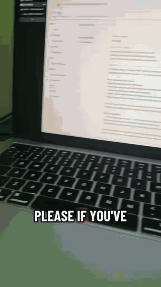

# BetterCast

BetterCast is an open-source screen extension app that turns almost any device into a wireless extra display for your Mac or Windows PC. Think Sidecar or AirPlay Receiver — but cross-platform and built for hardware Apple no longer supports, right down to using an old 5K iMac as a Thunderbolt display.

<p align="center">
  
</p>
<p align="center">
  <a href="https://youtube.com/shorts/m1FwRupqOZw">▶ Watch the full demo on YouTube</a>
</p>

## How It Works

**BetterCast** is a single unified Mac app that does both jobs: it can **send** your screen to other devices (creating a virtual display per receiver) and **receive** screens from other Macs in a separate window. Receivers on iOS, Windows, Linux, and Android are dedicated apps.

Each connected receiver gets its own virtual display with independent resolution, input handling, and optional audio streaming.

## Supported Platforms

| Platform | Role | Connection | Download |
|----------|------|------------|----------|
| **macOS** | Sender + Receiver | P2P Direct / WiFi | [bettercast.online](https://bettercast.online/#install) |
| **iOS / iPadOS** | Receiver | P2P Direct (AWDL) / WiFi | [bettercast.online](https://bettercast.online/#install) |
| **Windows** | Sender (beta) + Receiver | WiFi | [bettercast.online](https://bettercast.online/#install) |
| **Linux** | Receiver | WiFi | [bettercast.online](https://bettercast.online/#install) |
| **Android** | Receiver | WiFi / ADB USB | [bettercast.online](https://bettercast.online/#install) |

> The macOS DMG is notarized and signed with an Apple Developer certificate.

## Features

- **Multi-device** — Connect multiple receivers simultaneously, each with its own virtual display
- **Cross-platform input** — Mouse and keyboard pass-through from any receiver back to the Mac
- **Audio streaming** — Optional per-device AAC-LC audio forwarding (128 kbps stereo)
- **Adaptive quality** — Per-link tuning: AWDL P2P runs 60 FPS at full bitrate; WiFi infrastructure runs 30 FPS at the user-selected bitrate (default 20 Mbps) with shorter keyframe intervals for faster recovery on lossy links; ADB tunnels match P2P quality
- **Zero-config for Apple devices** — iOS/Mac receivers are discovered automatically via AWDL (no WiFi network needed)
- **mDNS discovery** — Windows/Linux/Android receivers are discovered automatically when on the same network

## Installation

### macOS (Sender + Receiver)

1. Download the latest DMG from [bettercast.online](https://bettercast.online/#install)
2. Open the DMG and drag **BetterCast** to your Applications folder
3. Launch **BetterCast** and grant the required permissions:
   - **Screen Recording** — to capture your display
   - **Accessibility** — to relay mouse and keyboard input from receivers

The receiver auto-starts in the background — no need to "switch modes". To send your screen, pick a discovered device from the sidebar. To receive, just leave the app open and another Mac/iOS device will see you in their list.

### iOS / iPadOS

The iOS receiver is [on the App Store](https://apps.apple.com/app/id6761002383). It is not yet available in the EU while App Store trader-status verification is pending.

### Windows

Download the installer from [bettercast.online](https://bettercast.online/#install) and run `BetterCastReceiver.exe`. Both devices must be on the same WiFi network.

### Linux

Download the AppImage from [bettercast.online](https://bettercast.online/#install). Make it executable (`chmod +x`) and run. Both devices must be on the same WiFi network.

### Android

Visit [bettercast.online](https://bettercast.online/#install) for the latest APK. Supports WiFi and USB via ADB tunnel.

## Networking

BetterCast uses **TCP (port 51820)** for the primary video/audio stream and **UDP (port 51821)** for chunked frame delivery. Service discovery uses mDNS (`_bettercast._tcp`).

- **Apple-to-Apple**: Uses AWDL (Apple Wireless Direct Link) for a direct P2P connection — no WiFi router needed
- **All other platforms**: Requires both devices to be on the same WiFi/LAN network
- **Hotspot**: If no shared network is available, create a hotspot on any device and connect the Mac to it

### Wire Protocol

Frames are sent as length-prefixed TCP messages with a 1-byte type tag:

```
[4-byte big-endian length] [1-byte type] [payload]
  type 0x01 = H.264 video (AVCC NALUs, no Annex B start codes)
  type 0x02 = AAC-LC audio (raw frames, no ADTS header)
```

Legacy receivers (pre-1.3 iOS / Mac Swift) use a different framing without the type byte; the desktop receiver auto-detects the format on the first frame of each connection.

## Release Notes

See [docs/release-notes/](docs/release-notes/) for per-version notes (v5–v8).

## Localization

The macOS app follows your system language. English, Simplified Chinese, Japanese, Korean, German, and French ship today, and community translations are welcome — adding a language is a single-file pull request. See [localization/README.md](localization/README.md).

## Support the Project

BetterCast is free and open source. If you find it useful and want to support development, you can donate here:

**[Donate on Whop](https://whop.com/bettercast/bettercast-donate/)**

## Disclaimer

**USE AT YOUR OWN RISK.**

This software is provided "as is", without warranty of any kind, express or implied. We are not responsible for any damages to your devices, data loss, or other issues that may occur while using this application.

BetterCast is fully open source. We encourage users to audit the code for safety and security. If you find any issues, please report them or contribute a fix.

## License & Contribution

BetterCast is licensed under the **GNU General Public License v3.0 (GPLv3)**.

### Why GPLv3?
We believe in the freedom of software and the collective benefit of open collaboration. We choose GPLv3 to specifically:
- **Prevent restrictive forks**: Anyone who modifies and distributes this code must also share their changes under the same license. You cannot take this open source project, modify it, and sell it as a closed-source product.
- **Encourage contribution**: We welcome contributions! By keeping the source open, we ensure that improvements benefit everyone.

We strongly encourage safety and transparency. If you are contributing, please ensure your code adheres to safety standards and respects user privacy.
